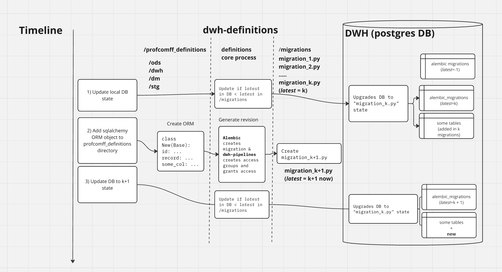

# Описание схем данных и выдача прав. Бибилиотека dwh-definitions.
Для эффктивной и дешевой поддержки хранилища данных нам надо было автоматизировать задачу администрирования доступов и миграций.


Подробнее про [доступы в postgres][permissions] и [миграции][migrations]


Для этого, на базе библиотеки для генерации миграций alembic, была разработана библиотека [dwh-definitions][definitions]


## Quick start

>Процесс добавления новой схемы выглядит примерно так:


Давайте по порядку:
1. Актуализация состояния ллокальной базы данных
    Так как миграции создаются на основании предыдущего состояния базы данных, важно чтобы это состояние в локальной базе было таким же, как на проде.
    Для этого достаточно активировать `venv` и выполнить 
    ```bash
    alembic upgrade head
    ```
    **Для EasyCode удобно будет воспользоваться таким набором команд**
    ```bash
    cd ~/dwh-dwfinitions;
    make venv;
    source venv/bin/activate;
    pip install -U -r requirements.dev.txt -r requirements.txt;
    deactivate; source venv/bin/activate
    ```
2. Создание pyhton класса, описывающего схему данных в базе
    Подробнее про описание можно почитать в документации [sqlalchemy][sqlalchemy]
3. Генерация миграции
    Теперь, когда необходимая схемв описана в python коде, нужно сгенерировать [миграцию][alembic]. Это набор команд, создающий такую же схему в постгресе, и выдающий необходимые права на нее.
    ```bash
    cd ~/dwh-dwfinitions;
    alembic revision --autogenerate -m "your message"
    ``` 
4. Для проверки сгенерированной миграции нужно снова сделать апгрейд (а также посмотреть код миграции глазами и удалить ненужные автоген комментарии!)
    ```bash
    cd ~/dwh-dwfinitions;
    alembic upgrade head
    ```

    

[permissions]: https://flaviocopes.com/postgres-user-permissions/
[migrations]: https://habr.com/ru/companies/yandex/articles/511892/
[definitions]: https://github.com/profcomff/dwh-definitions 
[sqlalchemy]: https://docs.sqlalchemy.org/en/20/orm/mapping_styles.html
[alembic]: https://alembic.sqlalchemy.org/en/latest/autogenerate.html