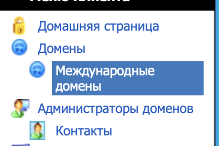
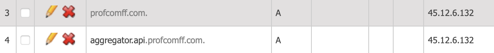
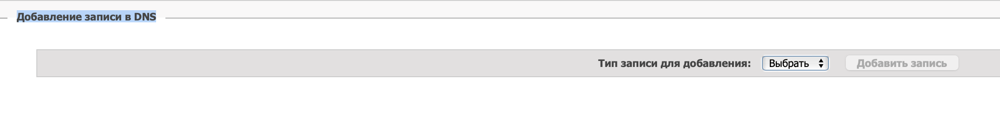
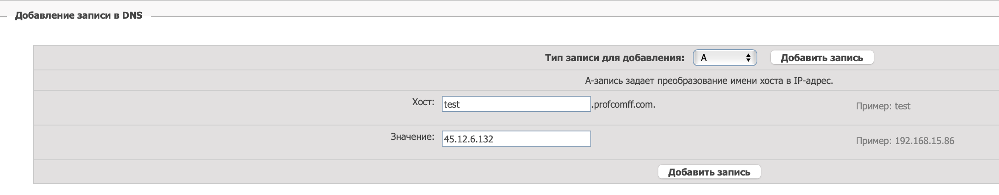

# Настройка DNS

## Что такое DNS

DNS - Domain Name System - это система, преобразующая человекочитаемые доменные имена в IP-адреса, понимаемые машиной.

DNS занимается тем, что преобразует названия сайтов — доменные имена, которые вводят в поисковую строку браузера в IP-адреса конкретных серверов. Если бы не было DNS, вам бы пришлось запоминать IP-адреса нужных вам ресурсов и вводить их вручную в браузер.

DNS-серверы бывают корневыми, они отвечают за самый верхний уровень — «.», отвечающими за геозоны — .ru,.com,.io,.by,.kz и локальные DNS-серверы.

Самая простая ситуация — это когда DNS-запись содержит лишь сведения о соотношении IP-адреса сервера с доменным именем, но данных может быть куда больше. Например, у сайта, поддоменов и почтового сервера могут быть разные IP-адреса и вся эта информация должна хранится в одном месте — специальном файле на DNS-сервере, его содержимое называется DNS-зона.

Файл содержит следующие типы записей:
```
А-запись — привязка IP-адреса веб-ресурса к конкретному имени домена;

AAAA-запись — преобразование имени хоста в IPV6-адрес;

MX-запись — адрес почтового сервера в текущем домене;

CNAME-запись — запись для подключения поддомена или перенаправления на основной домен;

NS-запись — адрес DNS-сервера, обслуживающего данный домен;

TXT-запись — произвольная текстовая информация о доменном имени;

SOA — начальная запись зоны, которая указывает местоположение эталонной записи о домене;
```

В каждой записи есть:
1. Доменное имя(например, `docs.profcomff.com` содержится в зоне `profcomff.com`)
2. TTL - время жизни кэша записи
3. Класс записи (обычно IN - сокращение от INternet)
4. Значение записи

### Пример
```
profcomff.com.		21600	IN	A	45.12.6.132
```
Говорит о том, что запись profcomff.com типа A, имеет TTL равный 21600 и ее значение `45.12.6.132`

### Пример
```
profcomff.com.		21600	IN	MX	10 mail.profcomff.com.
mail.profcomff.com.	21600	IN	A	45.12.6.132
```
Говорит о том, что запись profcomff.com типа MX(почта), имеет TTL равный 21600 и ее значение `10 mail.profcomff.com.` 10 - это приоритет записи, играет роль только если почтовых серверов много, тогда можно управлять ситуациями их падения.

`mail.profcomff.com` в свою очередь ведет на `45.12.6.132`

## Как работает DNS у нас
Мы успользуем DNS предоставляемый хостером домена profcomff.com
Узнать это можно так:
```
profcomff.com.		21600	IN	NS	ns2.r01.ru.
profcomff.com.		21600	IN	NS	ns1.r01.ru.
```
NS сервера это как раз сервера, обслуживающие данную зону.

Зону обслуживает компания r01

На их сайте можно редактировать эти записи.

## Как настроить DNS в Твой ФФ
В первую очередь надо получить туда доступ. Его можно запросить у лидов.

1. Заходим на [сайт](r01.ru)
2. Переходим во вкладку `Вход для клиентов`, заходим
3. Переходим на вкладку Домены->Международные домены



4. Нажимаем на синий значок с подписью `Нажмите для управления  DNS-зоной на DNS серверах регистратора`
5. Видим список записей

И так далее. На крест запись можно удалить, на каранад редактирование.

### Создание записи
Начинем с предыдущей страницы(шаг 5).

Пролистываем вверх и видим окно `Добавление записи в DNS`



Добавляем все поля, которые нас просят и нажимаем кнопку подтверждения.



Запись создана и разнесется по серверам регистратора в течение нескольких часов.

### Как понять какая должна быть запись
__Основной сценарий - надо добавить запись для нового микросервиса/базы данных__

В таком случае вам надо использовать A запись и направлять ее на IP адрес сервера на котором стоит конечный микросервис. 

Когда будет посылаться запрос, он разрезолвит доменное имя на соответствующий IPv4 и адресуется он на порт 443(https) или 80(http)

Принимается этот запрос нашим балансировщиком нагрузки(Caddy server). Он слушает как раз порты 80 и 443. О нем написана другая статья. И вот уже он, на основании запроса к нему пришедшего, делает выбор, в какой контейнер этот запрос послать.

Выглядит это примерно так:
```
api.profcomff.com:443 {
    route /marketing/* {
        reverse_proxy com_profcomff_api_marketing:80
    }
}
```
То есть, когда приходит запрос на конкретный сервер(IP мы знаем по записи DNS) он попадает в Caddy и, если его путь начинается с `/marketing`, то он перенаправляется в контейнер com_profcomff_api_marketing на порт 80 сразу внутрь контейнера.

__Еще сценарий состоит в том, что у вас уже есть готовое доменное имя, а вы хотите ему прописать алиас.__

В таком слуае вам пригодится CNAME запись.

Например:
```
pages.profcomff.com.	21600	IN	CNAME	profcomff.github.io.
```

Говорит о том, что pages.profcomff.com является алиасом к profcomff.github.io.

Такие записи сразу перенаправляются на алиас, настраивать наш Caddy не нужно.

__Остальные сценарии маловероятны__, хотя в теории вам может пригодится настроить почту по новому или еще что то, в таком случае информацию стоит поискать в гайдах в интернете.

### Как перенести сервис безболезненно
1. Если сервис не имеет состояния, тогда просто разверните новый сервис по новому адресу и поменяйте запись, старый сервис не трогайте. Какие то запросы будут идти в старый, какие то в новый, в коцне концов, все мигрирует на новый, когда у всех обновятся кэши

2. Если сервис имеет состояние и первый вариант невозможен, можно опустить TTL всех записей, относящихся к этому сервису в ноль, подождать пока изменения разнесутся, а дальше сделать миграцию: запустить новый сераис, остановить старый, поменять значение записи DNS, поднять TTL

### Создал запись а сервис все равно недоступен
Изменения разносятся какое то время(до нескольких часов), так что скорее всего дело в этом. В ином случае можно обратиться к более опытным людям.

### Как дебагать DNS записи
Поможет утилита `dig`. Для windows есть `nslookup`.

О команде `nslookup` есть подсказка [здесь](https://help.r01.ru/dns/faq/nslookup.html)

Сделаем что то командой `dig`: Запросим данные по домену `api.profcomff.com`
```
➜  projects dig api.profcomff.com

; <<>> DiG 9.10.6 <<>> api.profcomff.com
;; global options: +cmd
;; Got answer:
;; ->>HEADER<<- opcode: QUERY, status: NOERROR, id: 10415
;; flags: qr rd ra; QUERY: 1, ANSWER: 1, AUTHORITY: 2, ADDITIONAL: 1

;; OPT PSEUDOSECTION:
; EDNS: version: 0, flags:; udp: 4096
;; QUESTION SECTION:
;api.profcomff.com.		IN	A

;; ANSWER SECTION:
api.profcomff.com.	17858	IN	A	45.12.6.132

;; AUTHORITY SECTION:
profcomff.com.		19016	IN	NS	ns2.r01.ru.
profcomff.com.		19016	IN	NS	ns1.r01.ru.

;; Query time: 3 msec
;; SERVER: 192.168.0.1#53(192.168.0.1)
;; WHEN: Mon Jul 15 00:55:02 MSK 2024
;; MSG SIZE  rcvd: 104
```

Нас интересует ANSWER SECTION - там и есть ответ на ниш запрос.

Можно выбрать конкретный тип записи:
```
➜  projects dig api.profcomff.com A

; <<>> DiG 9.10.6 <<>> api.profcomff.com A
;; global options: +cmd
;; Got answer:
;; ->>HEADER<<- opcode: QUERY, status: NOERROR, id: 65383
;; flags: qr rd ra; QUERY: 1, ANSWER: 1, AUTHORITY: 2, ADDITIONAL: 1

;; OPT PSEUDOSECTION:
; EDNS: version: 0, flags:; udp: 4096
;; QUESTION SECTION:
;api.profcomff.com.		IN	A

;; ANSWER SECTION:
api.profcomff.com.	17789	IN	A	45.12.6.132

;; AUTHORITY SECTION:
profcomff.com.		18947	IN	NS	ns1.r01.ru.
profcomff.com.		18947	IN	NS	ns2.r01.ru.

;; Query time: 8 msec
;; SERVER: 192.168.0.1#53(192.168.0.1)
;; WHEN: Mon Jul 15 00:56:11 MSK 2024
;; MSG SIZE  rcvd: 104
```

Тут видно какие записи существуют и разнеслись по серверам.

Видно, что отвечает на запрос сервер `192.168.0.1#53` - это кэширующий локальный сервер. Запросы можно перенаправить на конкретный сервер, если вы знаете его адрес. Его моэно узнать вот так:

```
➜  projects dig profcomff.com  

; <<>> DiG 9.10.6 <<>> profcomff.com
;; global options: +cmd
;; Got answer:
;; ->>HEADER<<- opcode: QUERY, status: NOERROR, id: 17382
;; flags: qr rd ra; QUERY: 1, ANSWER: 1, AUTHORITY: 2, ADDITIONAL: 3

;; OPT PSEUDOSECTION:
; EDNS: version: 0, flags:; udp: 4096
;; QUESTION SECTION:
;profcomff.com.			IN	A

;; ANSWER SECTION:
profcomff.com.		17613	IN	A	45.12.6.132

;; AUTHORITY SECTION:
profcomff.com.		18228	IN	NS	ns2.r01.ru.
profcomff.com.		18228	IN	NS	ns1.r01.ru.

;; ADDITIONAL SECTION:
ns1.r01.ru.		98	IN	A	31.177.80.41
ns2.r01.ru.		98	IN	A	89.111.166.6

;; Query time: 27 msec
;; SERVER: 192.168.0.1#53(192.168.0.1)
;; WHEN: Mon Jul 15 01:08:10 MSK 2024
;; MSG SIZE  rcvd: 132
```

Нам нужны сервера из ADDITIONAL SECTION. Мы можем взять их IP и послать запрос на них конкретно:

```
➜  projects dig @31.177.80.41 -p 53 profcomff.com

; <<>> DiG 9.10.6 <<>> @31.177.80.41 -p 53 profcomff.com
; (1 server found)
;; global options: +cmd
;; Got answer:
;; ->>HEADER<<- opcode: QUERY, status: NOERROR, id: 59117
;; flags: qr aa rd; QUERY: 1, ANSWER: 1, AUTHORITY: 0, ADDITIONAL: 1
;; WARNING: recursion requested but not available

;; OPT PSEUDOSECTION:
; EDNS: version: 0, flags:; udp: 1232
;; QUESTION SECTION:
;profcomff.com.			IN	A

;; ANSWER SECTION:
profcomff.com.		21600	IN	A	45.12.6.132

;; Query time: 10 msec
;; SERVER: 31.177.80.41#53(31.177.80.41)
;; WHEN: Mon Jul 15 01:09:29 MSK 2024
;; MSG SIZE  rcvd: 58
```

Это может пригодится, если запись долго не обновляется у вас в кэше

Если записи не существует вамм будет приходить ответ без ANSWER SECTION:
```
➜  projects dig @31.177.80.41 -p 53 no.profcomff.com

; <<>> DiG 9.10.6 <<>> @31.177.80.41 -p 53 no.profcomff.com
; (1 server found)
;; global options: +cmd
;; Got answer:
;; ->>HEADER<<- opcode: QUERY, status: NXDOMAIN, id: 61686
;; flags: qr aa rd; QUERY: 1, ANSWER: 0, AUTHORITY: 1, ADDITIONAL: 1
;; WARNING: recursion requested but not available

;; OPT PSEUDOSECTION:
; EDNS: version: 0, flags:; udp: 1232
;; QUESTION SECTION:
;no.profcomff.com.		IN	A

;; AUTHORITY SECTION:
profcomff.com.		900	IN	SOA	ns1.r01.ru. noc.parkline.ru. 2024062216 10800 1800 604800 900

;; Query time: 4 msec
;; SERVER: 31.177.80.41#53(31.177.80.41)
;; WHEN: Mon Jul 15 01:12:48 MSK 2024
;; MSG SIZE  rcvd: 104
```

### У кого просить помощи
У людей, имеющих доступ к r01 уже давно, на момент написания статьи это Роман и Семен. Спросите их контакты в чате команды.