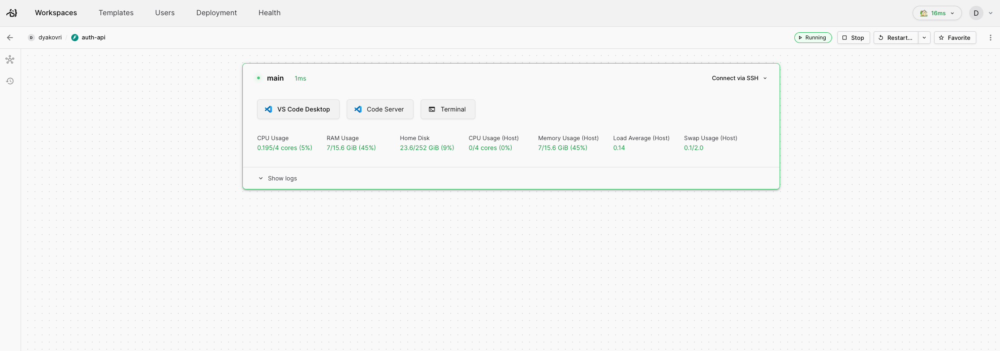

# Подготовка рабочего окружения

В этом разделе рассматривается подготовка рабочего окружения для разработки в Твой ФФ.

Все команды разработки преимущественно пользуются **Linux** в качестве операционной системы и **VS Code** в качестве редактора кода. Все сервисы мы создаем под среду исполнения **Docker** для решения проблем с конфликтами и замусореванием ОС.

Чтобы избавить вас от проблем с установкой всего необходимого софта мы подготовили сервис EasyCode, который позволит иметь на вашем компьютере минимум приложений.

## Подготовка рабочего окружения с использованием EasyCode

### Установка необходимого ПО

Для работы с EasyCode вам понадобится всего одно приложение на компьютере – редактор кода **Visual Studio Code**. Установить его можно с официального сайта по адресу <https://code.visualstudio.com/download>.

### Доступы

#### Аккаунт Твой ФФ

Все компоненты платформы завязаны на доступ в приложение Твой ФФ. Так что первым шагом зарегистрируйте аккаунт по ссылке: <https://app.profcomff.com/auth>.



Регистрировать аккаунт нужно по email и паролю!

В случае если у вас уже есть аккаунт, но он зарегистрирован по внешней социальной сети (то есть вы **не вводите пароль** для входа) – заполните форму [Запрос на ручную привязку почты](https://app.profcomff.com/apps/48). В ближайшее время привязать почту можно будет самостоятельно в личном кабинете Твой ФФ.



#### Форма инфраструктурных доступов

Заполните форму на получение доступов к компонентам: <https://app.profcomff.com/apps/46>.

Вам нужны:
- EasyCode
- GitHub (зарегистрироваться на <https://github.com> нужно самостоятельно)
- База данных (если вы в команде Backend или DWH)
- Airflow (если вы в команде DWH)
- DataLens (если вы в команде DWH, нужна регистрация на <https://my.msu.ru>)

Если вы не уверены, какие именно доступы вам нужны, запросите только часть, в которой вы уверены и обратитесь в вашему руководителю.

#### Привязка акканутов к приложению

Привяжите аккаунты GitHub и @my.msu.ru к приложению Твой ФФ:
1. Перейти в приложение Твой ФФ
2. Раздел "Профиль" (нижнее меню, третья кнопка)
   - Войти в профиль, если это еще не сделано
3. Настройки (правый верхний угол, кнопка с шестеренкой)
4. "Методы входа"

#### Проверка доступов

После того, как доступы будут получены (вам об этом напишет ваш менеджер), необходимо:
- Для GitHub доступ к организации <https://github.com/profcomff>
- Для DataLens проверить наличие папки **Профком** в списке доступных объектов <https://datalens.yandex.ru/?skipPromo=true> (в левом нижнем углу убедитесь, что используете аккаунт @my.msu.ru)
- Для остальных сервисов
  1. Перейти в приложение Твой ФФ
  2. Раздел "Профиль" (нижнее меню, третья кнопка)
     - Войти в профиль, если это еще не сделано
  3. Настройки (правый верхний угол, кнопка с шестеренкой)
  4. "Изменение пароля"
  5. Ввести старый и новый пароли
  6. Нажать кнопку "Изменить пароль"
  7. Новый пароль будет автоматически установлен во всех системах
  8. Проверить доступ к системам
    - Логин: ваши фамилия и инициалы маленькими буквами на латинице (транслит) или email из приложения Твой ФФ (где требуется email)
    - Пароль: вы только что установили
  9. Адреса сервисов:
    -  Airflow: <https://airflow.profcomff.com>
    -  EasyCode: <https://easycode.profcomff.com>
    -  База данных: <https://db.profcomff.com>

### Подключение к EasyCode

Все рабочие окружения доступны по адресу <https://easycode.profcomff.com>. Вы можете создавать их сами по готовым шаблонам или пользоваться кнопкой **EasyCode** в репозиториях на [GitHub](https://github.com/profcomff).

Если вы выбрали второй вариант, то поля `Repository url` и `Source folder` уже будут заполнены и вам нужно будет ввести только название окружения, которое остается на ваше усмотрение.

После нажатия кнопки **Create Workspace** пойдет загрузка, итогом которой будет готовое окружение со всеми необходимыми для разработки: программами, кодом и пр.

Нажмите кнопку **VS Code Desktop** для удаленного подключения к этому окружению.

## Подготовка рабочего окружения на своем компьютере



Мы не помогаем настраивать рабочую среду на своем компьютере. Это сложный процесс, который отличается в зависимости от используемых операционной системы, архитектуры процессора, уже установленного у вас ПО и ваших личных предпочтений



Список необходимого ПО, минимально необходимого для разработки Твой ФФ в различных средах.

Устанавливать рабочую среду рекомендуется на комьютере под управлением debian-like дистрибутивов Linux (Debian 12 или Ubuntu 22), в иных случаях работоспособность не гарантирована.



- Общие

  - [Git](https://git-scm.com/downloads)
  - [Docker](https://docs.docker.com/engine/install/)
  - [Visual Studio Code](https://code.visualstudio.com/download)
  - Расширения для VS Code:
    - [Thunder Client](https://marketplace.visualstudio.com/items?itemName=rangav.vscode-thunder-client)
    - [Docker](https://marketplace.visualstudio.com/items?itemName=ms-azuretools.vscode-docker)

- Backend

  - [Python 3.11](https://www.python.org/downloads/)
  - Расширения для VS Code:
    - [Database Client](https://marketplace.visualstudio.com/items?itemName=cweijan.vscode-database-client2)
    - [Python](https://marketplace.visualstudio.com/items\?itemName\=ms-python.python)
    - [Black Formatter](https://marketplace.visualstudio.com/items?itemName=ms-python.black-formatter)
    - [isort](https://marketplace.visualstudio.com/items?itemName=ms-python.isort)
    - [Pylance](https://marketplace.visualstudio.com/items?itemName=ms-python.vscode-pylance)

- Frontend
  - [Node.js v18](https://nodejs.org/en/download/package-manager)
  - Расширения для VS Code:
    - [Vue Language Features (Volar)](https://marketplace.visualstudio.com/items?itemName=Vue.volar)
    - [TypeScript Vue Plugin (Volar)](https://marketplace.visualstudio.com/items?itemName=Vue.vscode-typescript-vue-plugin)
    - [ESLint](https://marketplace.visualstudio.com/items?itemName=dbaeumer.vscode-eslint)
    - [Prettier - Code formatter](https://marketplace.visualstudio.com/items?itemName=esbenp.prettier-vscode)
    - [Auto Close Tag](https://marketplace.visualstudio.com/items?itemName=formulahendry.auto-close-tag)
    - [Auto Rename Tag](https://marketplace.visualstudio.com/items?itemName=formulahendry.auto-rename-tag)
    - [Auto Import](https://marketplace.visualstudio.com/items?itemName=steoates.autoimport)
    - [CSS Variable Autocomplete](https://marketplace.visualstudio.com/items?itemName=vunguyentuan.vscode-css-variables)

- Разработка DWH
  - [Python 3.11](https://www.python.org/downloads/)
  - Airflow с расширениями по инструкции <https://github.com/profcomff/dwh-airflow>
  - Расширения для VS Code:
    - [Database Client](https://marketplace.visualstudio.com/items?itemName=cweijan.vscode-database-client2)
    - [Python](https://marketplace.visualstudio.com/items\?itemName\=ms-python.python)



