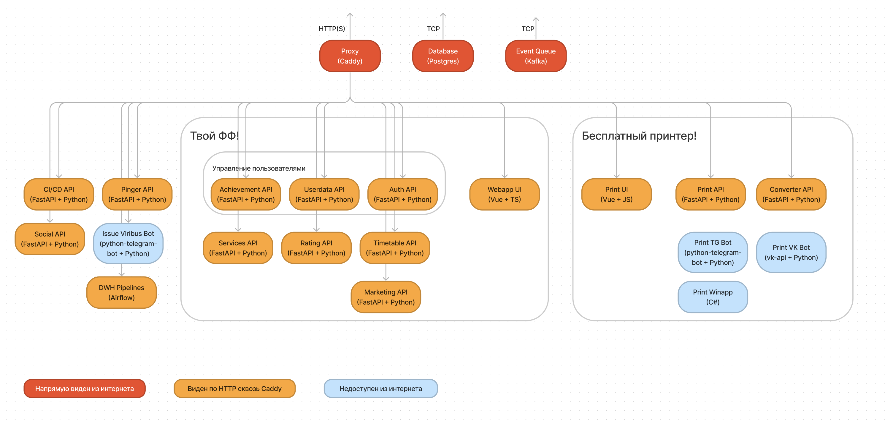
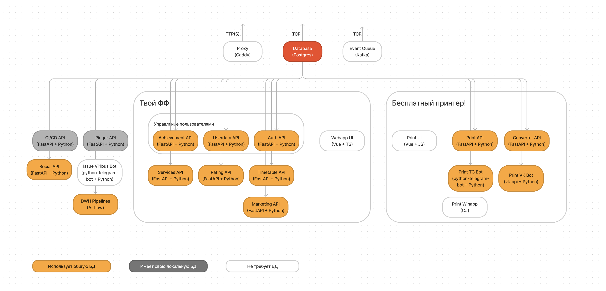
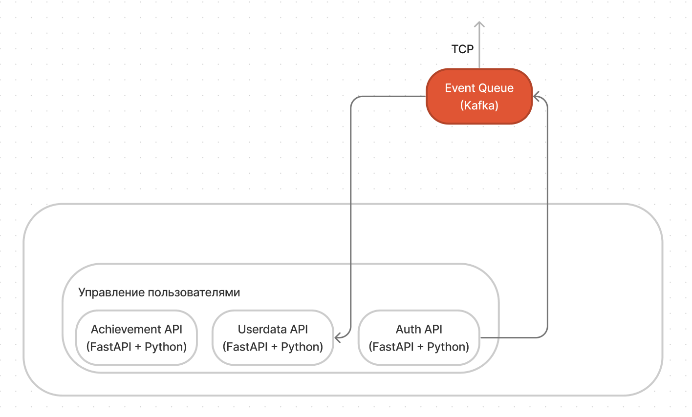

# Архитектура приложения

## Все сервисы

### Системное
_Нужны для работы всего приложения. Подняты, в отличие от всех остальных сервисов, в единственном экземпляре, общем для прода и теста._
- Proxy (Caddy) – Необходим для общения сервера по HTTP с внешним миром. Позволяет держать на одном сервере несколько сервисов и создавать безопасные HTTPS соединения
- Database (Postgres) – Используется для хранения всех данных
- [Event Queue (Kafka)](https://github.com/profcomff/db-kafka) – Используется для передачи данных/событий между сервисами

### Твой ФФ!
- [Webapp UI](https://github.com/profcomff/webapp-ui) – Приложение, которое видят пользователи, включая расписание, меню, админки
- [Services API](https://github.com/profcomff/services-api) – Программный интерфейс для работы списка приложений (меню) в приложении
- [Timetable API](https://github.com/profcomff/timetable-api) – Программный интерфейс для работы календаря-расписания
- [Rating API](https://github.com/profcomff/rating-api) _(не реализован)_ – Программный интерфейс для работы рейтинга преподавателей и отзывов (дубинушка)
- Управление пользователями
    - [Auth API](https://github.com/profcomff/auth-api) – Программный интерфейс для проверки личности (аутентификации) и доступов (авторизации) пользователя
    - [Userdata API](https://github.com/profcomff/userdata-api) – Программный интерфейс для управления данными о пользователях
    - [Achievement API](https://github.com/profcomff/achievement-api) – Программный интерфейс уплавления достижениями пользователей
- [Marketing API](https://github.com/profcomff/marketing-api) – Программный интерфейс для. Так же используется для хранения логов терминала принтера

### Бесплатный принтер
- [Print UI](https://github.com/profcomff/print-webapp) – Приложение принтера, которое видят пользователи
- [Print TG Bot](https://github.com/profcomff/print-tgbot) – Бот принтера для телеграм
- [Print VK Bot](https://github.com/profcomff/print-vkbot) – Бот принтера для ВК
- [Print API](https://github.com/profcomff/print-api) – Программный интерфейс для принятия заданий на печать и отправки файлов на терминалы
- [Converter API](https://github.com/profcomff/converter-api) _(не введен в эксплуатацию)_ – Программный интерфейс для конвертации форматов (например, DOCX в PDF) для принтера
- [Print Winapp](https://github.com/profcomff/print-winapp) – Приложение на ПК для получения по коду данных из API и отправки на печать

### Сбор и обработка данных
- DWH – комплекс для сбора данных из различных источников и из обработки
    - [DWH Airflow](https://github.com/profcomff/dwh-airflow) – настройки для сборки своей версии приложения Airflow
    - [DWH Definitions](https://github.com/profcomff/dwh-definitions) – описания объектов БД
    - [DWH Pipelines](https://github.com/profcomff/dwh-pipelines) – сами программы для обработки данных

### Другие сервисы
- [Social API](https://github.com/profcomff/social-api) – сервис для получения событий из различных сервисов (соцсетей VK, Telegram, GitHub), обработки и реакции на них
- [Issue Viribus TgBot](https://github.com/profcomff/issue-github-tgbot/) – бот для создания задач на [доске](https://github.com/orgs/profcomff/projects/7) из телеграмма
- [CI/CD API](https://github.com/profcomff/cicd-api) _(ограниченно введен в эксплуатацию)_ – программный интерфейс для запуска приложений по запросу от GitHub. Используется только для DEV среды Webapp UI. **Требует доработки.**
- [Pinger API](https://github.com/profcomff/aciniformes-project) _(не введен в эксплуатацию)_ – приложение для проверки, что наши сервисы работают, и отправки уведомлений в случае, если нет. **Требует доработки.**

## Связи
### HTTPS
По HTTP у нас ходят в интернет почти все сервисы, за исключение ботов, созданных @Annndruha, и винаппа не стоящего на нашем сервере

Есть внутренняя связь по HTTP между Auth API и остальными API (питон программами) с использованием [Auth Lib](https://github.com/profcomff/auth-lib). Это **единственная** внутренняя зависимость между сервисами.

### БД
Базу данных используют все сервисы, кроме:
- Issue Viribus Bot – не требует БД
- UI и Print Winapp – находятся на стороне пользователя, не требуют БД
- CI/CD API и Pinger API – находятся на сторонних серверах и имеют свои локальные БД

### Очередь событий
Позволяет асинхронно передавать данные между сервисами. Мы передаем данные в формате JSON, схемы данных лежат в [event-schema](https://github.com/profcomff/event-schema). Сейчас данные передаются только между Auth API и Userdata API.

